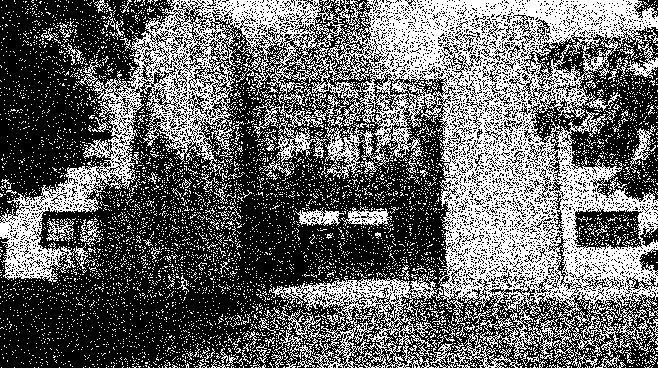

# Ditherpunk: Retour au Monochrome

## 👥 Équipe

- **Membres** :
  - 🧑‍💻 Ouzet Killian - 31B
  - 🧑‍💻 Gardelle Anthony - 31B

## ⚙️ Fonctionnalités à implémenter

Les fonctionnalités principales incluent :  
1️⃣ **Transformation d'images en monochrome (noir et blanc)**  
2️⃣ **Réduction d'une image à une palette limitée**  
3️⃣ **Gestion des options via une interface en ligne de commande intuitive**  
4️⃣ **Exportation des résultats dans un fichier image**

Les parties prioritaires du projet sont les **sections 1 à 4 et 7** de l'énoncé.  
Les sections **5 et 6** permettent d'aller plus loin pour obtenir une solution remarquable.

## 📅 Date de rendu

⏳ **Le projet doit être finalisé et remis au plus tard le 23 janvier.**

## Réponses aux questions

### 1. La bibliothèque image

#### Question 1

- Créer un nouveau projet Cargo, avec une dépendance sur la bibliothèque image, version 0.24.

  - Réponse :  
    Pour créer un nouveau projet Cargo et le configurer pour utiliser image, il faut exécuter les commande suivante :

    ```bash
    cargo new ditherpunk
    cd ditherpunk
    cargo add image@0.24.9
    ```

---

#### Question 2

- À quoi correspond le type DynamicImage ?

  - Réponse :  
    DynamicImage est une enum pour les formats ImageBuffer qui prend en charge les différents types d'image comme par exemple les images RGB8, RGBA8, ou Grayscale.

- Comment obtenir une image en mode rbg8 à partir de ce DynamicImage ?

  - Réponse :  
    Pour convertir une image DynamicImage en mode rgb8 il faut utiliser la méthode to_rgb8().

    ```rust
    use image::io::Reader as ImageReader;

    fn main() -> Result<(), Box<dyn std::error::Error>> {
      let img = ImageReader::open("./static/img/iut.jpg")?.decode()?;
      let img_rgb = img.to_rgb8();
      Ok(())
    }
    ```

---

#### Question 3

- Sauver l'image obtenue au format png. Que se passe-t-il si l'image de départ avait un canal
  alpha?

  - Réponse :  
    Pour sauver l'image obtenue on peut utiliser la méthode save().

    ```rust
    use image::io::Reader as ImageReader;

    fn main() -> Result<(), Box<dyn std::error::Error>> {
      let img = ImageReader::open("./static/img/iut.jpg")?.decode()?;
      let img_rgb = img.to_rgb8();
      img_rgb.save("./static/img/out_img_rgb.png")?;
      Ok(())
    }
    ```

    Si l'image de départ avait un canal alpha alors celui-ci est recalculé par rapport au autre canaux car la méthode to_rgb8() renvoie une image de seulement trois composante RGB (Rouge Vert Bleu).

---

#### Question 4

- Afficher dans le terminal la couleur du pixel (32, 52) de l'image de votre choix.

  - Réponse :  
    Pour afficher dans le terminal la couleur d'un pixel il faut utiliser la méthode get_pixel() puis récupérer les data du pixel.

    ```rust
    use image::{io::Reader as ImageReader, GenericImageView};

    fn main() -> Result<(), Box<dyn std::error::Error>> {
        let img = ImageReader::open("./static/img/iut.jpg")?.decode()?;
        let pixel = img.get_pixel(32, 52);
        println!("Couleur : R={} G={} B={} A={}", pixel[0], pixel[1], pixel[2], pixel[3]);
        Ok(())
    }
    ```

---

#### Question 5

- Passer un pixel sur deux d'une image en blanc. Est-ce que l'image obtenue est reconnaissable ?

  - Réponse :  
    Oui, l'image est quand même reconnaissable.

    ```rust
    use image::{io::Reader as ImageReader, Rgb};

    fn main() -> Result<(), Box<dyn std::error::Error>> {
        let mut img = ImageReader::open("./static/img/iut.jpg")?
            .decode()?
            .to_rgb8();
        for (x, y, pixel) in img.enumerate_pixels_mut() {
            if (x + y) % 2 == 0 {
                *pixel = Rgb([255, 255, 255]);
            }
        }
        img.save("./static/img/iut_blanc_un_sur_deux.jpg")?;
        Ok(())
    }
    ```

---

### 2. Passage en monochrome par seuillage

#### Question 6

- Comment récupérer la luminosité d'un pixel ?

  - Réponse :  
    Pour récupérer la luminosité d'un pixel il faut calculer la luminance de celui-ci. La luminance (luma) est une grandeur correspondant à la sensation visuelle de luminosité d'une surface. On peut ensuite donc calculer luma avec une opération de matriçage des composantes RGB. On peut calculer la luminance en faisant la moyenne des trois composantes mais ce n'est pas trés réaliste car l'Humain est plus sensible au vert qu'au rouge ou au bleu. Nous allons donc utilisé la recommandations UIT-R BT 709 (Rec. 709) qui est une norme dans l'industrie audiovisuelle pour la télévision à haute définition (TVHD).
    ```math
      Y' = 0.2126 * R' + 0.7152 * G' + 0.0722 * B'
    ```
    Signification des termes :
    - Y' : La luminosité perçue du pixel (valeur en niveaux de gris).
    - R' : La composante rouge de la couleur du pixel (entre 0 et 255).
    - G' : La composante verte de la couleur du pixel (entre 0 et 255).
    - B' : La composante bleue de la couleur du pixel (entre 0 et 255).
    - Les coefficients 0.2126, 0.7152, et 0.0722 reflètent la sensibilité relative de l'œil humain au rouge, au vert et au bleu, respectivement.

---

#### Question 7

- Implémenter le traitement

  - Réponse :

    ```rust
    use image::{io::Reader as ImageReader, Rgb};

    fn main() -> Result<(), Box<dyn std::error::Error>> {
        let mut img = ImageReader::open("./static/img/iut.jpg")?
            .decode()?
            .to_rgb8();
        for (_x, _y, pixel) in img.enumerate_pixels_mut() {
            let luma = 0.2126 * pixel[0] as f32 + 0.7152 * pixel[1] as f32 + 0.0722 * pixel[2] as f32;
            if luma > 128.0 {
                *pixel = Rgb([255, 255, 255]);
            } else {
                *pixel = Rgb([0, 0, 0]);
            }
        }
        img.save("./static/img/iut_monochrome_blanc_noir.jpg")?;
        Ok(())
    }
    ```

---

#### Question 8

- Permettre à l'utilisateurice de remplacer "noir" et "blanc" par une paire de couleurs au choix.

  - Réponse :

    Lors de l'appel de la fonction **monochrome_par_paire** il faut lui mettre en paramètre le chemin de l'image source et un vecteur contenant les deux couleur de la paire.

    ```rust
    use csscolorparser::Color;
    use image::{io::Reader as ImageReader, Rgb, Rgba};
    use std::error::Error;

    fn rgba8_to_string(composantes: Rgba<u8>) -> String {
        match composantes {
            Rgba([255, 0, 0, 255]) => "red".to_string(),
            Rgba([0, 255, 0, 255]) => "green".to_string(),
            Rgba([0, 0, 255, 255]) => "blue".to_string(),
            Rgba([255, 255, 0, 255]) => "yellow".to_string(),
            Rgba([0, 255, 255, 255]) => "cyan".to_string(),
            Rgba([255, 0, 255, 255]) => "magenta".to_string(),
            Rgba([0, 0, 0, 255]) => "black".to_string(),
            Rgba([255, 255, 255, 255]) => "white".to_string(),
            Rgba([160, 82, 45, 255]) => "sienna".to_string(),
            Rgba([128, 0, 128, 255]) => "purple".to_string(),
            _ => panic!("Couleur non supportée"),
        }
    }

    fn parse_color(color_str: &str, default: Color) -> [u8; 4] {
        color_str
            .parse::<Color>()
            .unwrap_or_else(|_| {
                println!(
                    "Erreur : '{}' n'est pas une couleur valide. Utilisation de la couleur par défaut.",
                    color_str
                );
                default.clone()
            })
            .to_rgba8()
    }

    fn monochrome_par_paire(
        chemin_img: &str,
        paire: &[&str],
    ) -> Result<(), Box<dyn Error>> {
        let mut img = ImageReader::open(chemin_img)?.decode()?.to_rgb8();
        let couleur1 = parse_color(paire[0], Color::new(1.0, 1.0, 1.0, 1.0));
        let couleur2 = parse_color(paire[1], Color::new(0.0, 0.0, 0.0, 1.0));

        for pixel in img.pixels_mut() {
            let luma = 0.2126 * pixel[0] as f32 + 0.7152 * pixel[1] as f32 + 0.0722 * pixel[2] as f32;
            if luma > 128.0 {
                *pixel = Rgb([couleur1[0], couleur1[1], couleur1[2]]);
            } else {
                *pixel = Rgb([couleur2[0], couleur2[1], couleur2[2]]);
            }
        }

        let output_path = format!(
            "./static/img/iut_monochrome_{}_{}.jpg",
            rgba8_to_string(Rgba(couleur1)),
            rgba8_to_string(Rgba(couleur2))
        );
        img.save(output_path)?;
        Ok(())
    }

    fn main() -> Result<(), Box<dyn Error>> {
        let chemin_img = "./static/img/iut.jpg";
        let paire = vec!["red", "blue"];
        monochrome_par_paire(chemin_img, &paire)?;
        Ok(())
    }
    ```

---

### 3. Passage à une palette

#### Question 9

- Comment calculer la distance entre deux couleurs ?

  - Réponse :  
    Pour calculer la distance entre deux couleurs plusieurs solutions s'offre à nous. On choisie d'utiliser la distance euclidienne des deux couleurs dans un espace RGB.

    ```math
    d = \sqrt{(R_2 - R_1)^2 + (G_2 - G_1)^2 + (B_2 - B_1)^2}
    ```

    Signification des termes :

    - R : La composante rouge du pixel (de 0 à 255)
    - G : La composante verte du pixel (de 0 à 255)
    - B : La composante bleue du pixel (de 0 à 255)

---

#### Question 10

- Implémenter le traitement

  - Réponse :

    ```rust
    fn passage_a_une_palette(chemin_img: &str, palette: Vec<&str>) -> Result<(), Box<dyn Error>> {
        let mut img = ImageReader::open(chemin_img)?.decode()?.to_rgb8();
        for pixel in img.pixels_mut() {
            let mut min_d = std::f32::MAX;
            let mut min_couleur = Rgb([0, 0, 0]);
            for couleur_str in &palette {
                let couleur_rgb = string_to_rgb8(couleur_str);
                let d = euclidean_distance(pixel, &couleur_rgb);
                if d < min_d {
                    min_d = d;
                    min_couleur = couleur_rgb;
                }
            }
            *pixel = min_couleur;
        }
        let output_path = format!("./static/img/iut_palette_{}.jpg", palette.join("_"));
        img.save(output_path)?;
        Ok(())
    }
    ```

---

### 4. Tramage aléatoire (dithering)

#### Question 12

- Implémenter le tramage aléatoire des images.

  - Réponse :

    ```rust
    use image::{io::Reader as ImageReader, Rgb};
    use std::rand;
    use std::rand::Rng;

    fn tramage_random(
      chemin_img: &str,
    ) -> Result<(), Box<dyn Error>> {
        let mut rng = rand::thread_rng();
        let mut img = ImageReader::open(chemin_img)?.decode()?.to_rgb8();

        for (_x, _y, pixel) in img.enumerate_pixels_mut() {
            let luma = (0.2126 * pixel[0] as f32 + 0.7152 * pixel[1] as f32 + 0.0722 * pixel[2] as f32) as f64 / 255.0;
            if luma > rng.gen() {
                *pixel = Rgb([255, 255, 255]);
            } else {
                *pixel = Rgb([0, 0, 0]);
            }
        }

        img.save("./static/img/iut_tramage_random.jpg")?;
        Ok(())
    }


    fn main() -> Result<(), Box<dyn Error>> {
        let chemin_img = "./static/img/iut.jpg";
        let paire = vec!["red", "blue"];
        monochrome_par_paire(chemin_img, &paire)?;
        tramage_random(chemin_img)?;
        Ok(())
    }
    ```

  - Résultat :

  

---

### 5 Utilisation de la matrice de Bayer comme trame

#### Question 13

- Déterminer B3

  - Réponse :

    - U2 :

    $$
    \left(\begin{array}{cc}
    1 & 1 & 1 & 1\\
    1 & 1 & 1 & 1\\
    1 & 1 & 1 & 1\\
    1 & 1 & 1 & 1
    \end{array}\right)
    $$

    - B3 :

    $$
    1/64.
    \left(\begin{array}{cc}
    \left(\begin{array}{cc}
    0 & 32 &8 & 40 \\
    48 & 16 & 56 & 24\\
    12 & 44 & 4	& 36\\
    60 & 28 & 52 & 20
    \end{array}\right)
    \left(\begin{array}{cc}
    2 & 34 & 10 &	42\\
    50 & 18 & 58 & 26\\
    14 & 46 & 6 & 38\\
    62 & 30 & 54 & 22\\
    \end{array}\right)
    \\
    \left(\begin{array}{cc}
    3 & 35 & 11	& 43\\
    51 & 19	& 59 & 27\\
    15 & 47 & 7 & 39\\
    63 & 31	& 55 & 23\\
    \end{array}\right)
    \left(\begin{array}{cc}
    1 & 33 & 9 & 41\\
    49 & 17	& 57 & 25\\
    13 & 45 & 5	& 37\\
    61 & 29	& 53 & 21\\
    \end{array}\right)
    \\
    \end{array}\right)
    $$

- Résultat :

  $$
  1/64.
  \left(\begin{array}{cc}
  0 & 32 &8 & 40 & 2 & 34 & 10 &	42 \\
  48 & 16 & 56 & 24 & 50 & 18 & 58 & 26\\
  12 & 44 & 4	& 36 & 14 & 46 & 6 & 38\\
  60 & 28 & 52 & 20 & 62 & 30 & 54 & 22\\
  3 & 35 & 11	& 43 & 1 & 33 & 9 & 41\\
  51 & 19	& 59 & 27 & 49 & 17	& 57 & 25\\
  15 & 47 & 7 & 39 & 13 & 45 & 5	& 37\\
  63 & 31	& 55 & 23 & 61 & 29	& 53 & 21\\
  \end{array}\right)
  $$

#### Question 14

- Quel type de données utiliser pour représenter la matrice de Bayer? Comment créer une matrice de Bayer d’ordre arbitraire?

  - Réponse :

    Pour implémenter la matrice de bayer nous avons pensé évidemment à l'utilisation des tableaux et plus particuièrement d'un tableau contenant d'autres tableaux, afin de pouvoir mieux représenter les lignes et colonnes. Pour ce faire nous avons donc créer un struct "MatriceBayer" contenant la matrice de type "Vec<Vec<u32>>" et la taille de celle-ci en "usize".

    ```rust
    /// Représente une matrice de Bayer, avec les fonctions pour la générer
    struct MatriceBayer {
        taille: usize,
        matrice: Vec<Vec<u32>>,
    }
    ```

#### Question 15

- Implémenter le tramage par matrice de Bayer.

  - Réponse :

    L'implémentation du tramage par matrice de Bayer, dit Ordered Dithering, se sépare en deux partie. La première partie est la création et le calcul de l'algorithme et la deuxième partie est l'utilisation de cette matrice pour filter l'image.

    Les fonctions de générations sont implémenté directement dans le struct. Celles-ci sont au nombre de deux :

    - new_bayer_matrix(...), la fonction à appeler pour générer une matrice de bayer
    - calculer_bayer(...), une fonction récursive qui calcule chaque partie de la matrice.

  ```rust
  impl MatriceBayer {
    /// Génère une matrice de Bayer d'ordre `n`
    fn new_bayer_matrix(ordre: u32) -> Self {
        let taille = 2usize.pow(ordre);
        let mut matrice = vec![vec![0; taille]; taille];
        MatriceBayer::calculer_bayer(&mut matrice, 0, 0, taille, 1, 0);
        MatriceBayer { taille, matrice }
    }

    /// Génération récursive de la matrice
    fn calculer_bayer(matrice: &mut Vec<Vec<u32>>, x: usize, y: usize, taille: usize, etape: u32, valeur: u32) {
        if taille == 0 {
            matrice[y][x] = 0;
            return;
        }

        //println!("{:?}", valeur);

        if taille == 1 {
            matrice[y][x] = valeur;
            return;
        }

        //let matrice_clone = matrice.clone();
        // for row in matrice_clone {
        //     println!("{:?}", row);
        // }

        let milieu = taille / 2;

        //Calcule haut gauche
        Self::calculer_bayer(matrice, x, y, milieu, etape*4, valeur+(etape*0));
        //Calcule bas droite
        Self::calculer_bayer(matrice, x+milieu, y+milieu, milieu, etape*4, valeur+(etape*1));
        //Calcule haut droit
        Self::calculer_bayer(matrice, x+milieu, y, milieu, etape *4, valeur+(etape*2));
        //Calcule bas gauche
        Self::calculer_bayer(matrice, x, y+milieu, milieu, etape *4, valeur+(etape*3));

    }
  }
  ```

  Et enfin la fonction permettant de faire le tramage.
  Dans les tramages précédents, nous utilisions un seuil pour comparer avec la luminostié du pixel.
  Ici le seuil est l'une des valeurs de la matrice.
  En effet, le but du ordered dithering est de placer la matrice comme un motif sur l'image et pour chaque pixel nous prenons comme seuil la valeur superposé.
  Si jamais l'image à une plus grande résolution que la taille de la matrice alors la matrice est réutilisé à la chaine comme une mosaïque.

  ```rust
    fn ordered_dithering(
    chemin_img: &str,
    ordre: u32,
  ) -> Result<(), Box<dyn Error>> {
    let mut img = ImageReader::open(chemin_img)?.decode()?.to_rgb8();

    let bayer = MatriceBayer::new_bayer_matrix(ordre);

    for (_x, _y, pixel) in img.enumerate_pixels_mut() {
        let luma = (0.2126 * pixel[0] as f32 + 0.7152 * pixel[1] as f32 + 0.0722 * pixel[2] as f32) as f64 / 255.0;
        let seuil = bayer.matrice[(_y % bayer.taille as u32) as usize][(_x % bayer.taille as u32) as usize] as f32 * 1.0 / (bayer.taille * bayer.taille) as f32;
        if luma > seuil.into() {
            *pixel = Rgb([255, 255, 255]);
        } else {
            *pixel = Rgb([0, 0, 0]);
        }
    }

    img.save("./static/img/iut_ordered_dithering.jpg")?;
    Ok(())
  }
  ```

  - Résultat :

  

---

### 6. Diffusion d’erreur

#### Question 16

- Implémenter un mécanisme de diffusion d’erreur suivant la matrice ci-dessous pour les images en noir et blanc

  ```math
  \begin{pmatrix}
  * & 0.5 \\
  0.5 & 0
  \end{pmatrix}
  ```

  - Réponse :

    ```rust
    fn diffusion_d_erreur_simple(chemin_img: &str) -> Result<(), Box<dyn Error>> {
        let mut img = ImageReader::open(chemin_img)?.decode()?.to_rgb8();
        let largeur = img.width();
        let hauteur = img.height();

        for x in 0..largeur {
            for y in 0..hauteur {
                let pixel = img.get_pixel(x, y);
                let luma =
                    0.2126 * pixel[0] as f32 + 0.7152 * pixel[1] as f32 + 0.0722 * pixel[2] as f32;
                let nouvelle_valeur = if luma > 128.0 { 255.0 } else { 0.0 };
                let erreur = luma - nouvelle_valeur;

                img.put_pixel(
                    x,
                    y,
                    Rgb([
                        nouvelle_valeur as u8,
                        nouvelle_valeur as u8,
                        nouvelle_valeur as u8,
                    ]),
                );

                if x + 1 < largeur {
                    let voisin = img.get_pixel(x + 1, y);
                    let voisin_luma = 0.2126 * voisin[0] as f32
                        + 0.7152 * voisin[1] as f32
                        + 0.0722 * voisin[2] as f32;
                    let valeur_mise_a_jour = voisin_luma + 0.5 * erreur;
                    img.put_pixel(
                        x + 1,
                        y,
                        Rgb([
                            (valeur_mise_a_jour.clamp(0.0, 255.0)) as u8,
                            (valeur_mise_a_jour.clamp(0.0, 255.0)) as u8,
                            (valeur_mise_a_jour.clamp(0.0, 255.0)) as u8,
                        ]),
                    );
                }
                if y + 1 < hauteur {
                    let voisin = img.get_pixel(x, y + 1);
                    let voisin_luma = 0.2126 * voisin[0] as f32
                        + 0.7152 * voisin[1] as f32
                        + 0.0722 * voisin[2] as f32;
                    let valeur_mise_a_jour = voisin_luma + 0.5 * erreur;
                    img.put_pixel(
                        x,
                        y + 1,
                        Rgb([
                            (valeur_mise_a_jour.clamp(0.0, 255.0)) as u8,
                            (valeur_mise_a_jour.clamp(0.0, 255.0)) as u8,
                            (valeur_mise_a_jour.clamp(0.0, 255.0)) as u8,
                        ]),
                    );
                }
            }
        }

        img.save("./static/img/iut_diffusion_d_erreur_simple.jpg")?;
        Ok(())
    }
    ```

---

#### Question 17

- Pour une palette de couleurs comme dans la partie 3, expliquer dans votre README comment
  vous représentez l’erreur commise à chaque pixel, comment vous la diffusez.

      - Réponse :

        L'erreur est définie comme la différence entre la couleur d'origine du pixel et la couleur quantifiée.

        Erreur (R, G, B) : Pour un pixel donné, l'erreur est un vecteur calculé comme suit :

        ```math
        Erreur = ((R_{original}​ - R_{quantifié}), (G_{original}​ - G_{quantifié}), (B_{original}​ - B_{quantifié}))
        ```

        où 𝑅,G,B représentent les composantes rouge, verte et bleue du pixel.

        Cette erreur représente la quantité de "perte d'information" pour ce pixel spécifique lors de l'arrondi à une couleur de la palette.

        Pour limiter l'impact visuel des erreurs de quantification, nous utilisons un algorithme de diffusion d'erreur. L'idée est de répartir l'erreur du pixel courant sur les pixels voisins qui n'ont pas encore été traités. Cela permet de préserver une qualité visuelle en redistribuant les erreurs sur l'ensemble de l'image.

        Nous utilisons une matrice comme méthode de diffusion d'erreur. La distribution est réalisée selon un schéma pondéré sur les pixels voisins comme suit :

        ```math
        \begin{pmatrix}
        * & 0.5 \\
        0.5 & 0
        \end{pmatrix}
        ```

        - Le pixel actuel est marqué par ∗.
        - L'erreur calculée est multipliée par les pondérations indiquées (0.5, 0.5) et ajoutée aux pixels voisins correspondants.
        - Ces pondérations sont choisies pour diffuser l'erreur de manière proportionnelle et naturelle.

---

#### Question 18

- Implémenter la diffusion d’erreur pour la palettisation d’images.

  - Réponse :

    ```rust
    fn diffusion_d_erreur_simple_palette(
          chemin_img: &str,
          palette: &Vec<&str>,
      ) -> Result<(), Box<dyn Error>> {
          let mut img = ImageReader::open(chemin_img)?.decode()?.to_rgb8();
          let largeur = img.width();
          let hauteur = img.height();

          let palette_rgb: Vec<Rgb<u8>> = palette.iter().map(|&c| string_to_rgb8(c)).collect();

          for y in 0..hauteur {
              for x in 0..largeur {
                  let current_pixel = img.get_pixel(x, y);
                  let closest = couleur_la_plus_proche(current_pixel, &palette_rgb);

                  let error = [
                      current_pixel[0] as i16 - closest[0] as i16,
                      current_pixel[1] as i16 - closest[1] as i16,
                      current_pixel[2] as i16 - closest[2] as i16,
                  ];

                  img.put_pixel(x, y, closest);

                  if x + 1 < largeur {
                      for c in 0..3 {
                          let neighbor = img.get_pixel_mut(x + 1, y);
                          let value = neighbor[c] as i16 + (error[c] as f32 * 0.5) as i16;
                          neighbor[c] = value.clamp(0, 255) as u8;
                      }
                  }
                  if y + 1 < hauteur {
                      for c in 0..3 {
                          let neighbor = img.get_pixel_mut(x, y + 1);
                          let value = neighbor[c] as i16 + (error[c] as f32 * 0.5) as i16;
                          neighbor[c] = value.clamp(0, 255) as u8;
                      }
                  }
              }
          }

          let output_path = format!(
              "./static/img/iut_diffusion_d_erreur_simple_palette_{}.jpg",
              palette.join("_")
          );
          img.save(output_path)?;
          Ok(())
    }
    ```

---

#### Question 19

- Implémenter la diffusion d’erreur pour la matrice de Floyd-Steinberg

  ```math
  \frac{1}{16}
  \begin{pmatrix}
  0 & * & 7 \\
  3 & 5 & 1
  \end{pmatrix}
  ```

  - Réponse :

    ```rust
    fn diffusion_d_erreur_floyd_steinberg_palette(
        chemin_img: &str,
        palette: &Vec<&str>,
        ) -> Result<(), Box<dyn Error>> {
        let mut img = ImageReader::open(chemin_img)?.decode()?.to_rgb8();
        let largeur = img.width();
        let hauteur = img.height();

        let palette_rgb: Vec<Rgb<u8>> = palette.iter().map(|&c| string_to_rgb8(c)).collect();

        for y in 0..hauteur {
            for x in 0..largeur {
                let current_pixel = img.get_pixel(x, y);
                let closest = couleur_la_plus_proche(current_pixel, &palette_rgb);

                let error = [
                    current_pixel[0] as i16 - closest[0] as i16,
                    current_pixel[1] as i16 - closest[1] as i16,
                    current_pixel[2] as i16 - closest[2] as i16,
                ];

                img.put_pixel(x, y, closest);

                if x + 1 < largeur {
                    for c in 0..3 {
                        let neighbor = img.get_pixel_mut(x + 1, y);
                        let value = neighbor[c] as i16 + (error[c] * 7 / 16);
                        neighbor[c] = value.clamp(0, 255) as u8;
                    }
                }
                if y + 1 < hauteur {
                    if x > 0 {
                        for c in 0..3 {
                            let neighbor = img.get_pixel_mut(x - 1, y + 1);
                            let value = neighbor[c] as i16 + (error[c] * 3 / 16);
                            neighbor[c] = value.clamp(0, 255) as u8;
                        }
                    }
                    for c in 0..3 {
                        let neighbor = img.get_pixel_mut(x, y + 1);
                        let value = neighbor[c] as i16 + (error[c] * 5 / 16);
                        neighbor[c] = value.clamp(0, 255) as u8;
                    }
                    if x + 1 < largeur {
                        for c in 0..3 {
                            let neighbor = img.get_pixel_mut(x + 1, y + 1);
                            let value = neighbor[c] as i16 + (error[c] * 1 / 16);
                            neighbor[c] = value.clamp(0, 255) as u8;
                        }
                    }
                }
            }
        }

        let output_path = format!(
            "./static/img/iut_diffusion_d_erreur_floyd_steinberg_palette_{}.jpg",
            palette.join("_")
        );
        img.save(output_path)?;
        Ok(())
    }
    ```

---

#### Question 20

- Comment représenter une matrice de diffusion d’erreur arbitraire? Permettre de changer de
  matrice de diffusion d’erreurs, et tester les matrices de diffusion de Jarvis-Judice-Ninke et Atkinson

  ```math
  \
  \frac{1}{48}
  \begin{pmatrix}
  0 & 0 & * & 7 & 5 \\
  3 & 5 & 7 & 5 & 3 \\
  1 & 3 & 5 & 3 & 1
  \end{pmatrix}
  \quad
  \frac{1}{8}
  \begin{pmatrix}
  0 & * & 1 & 1 \\
  1 & 1 & 1 & 0 \\
  0 & 1 & 0 & 0
  \end{pmatrix}.
  \
  ```

      - Réponse :

      ```rust
      fn diffusion_d_erreur_palette_matrice(
      chemin_img: &str,
      palette: &Vec<&str>,
      diffusion_matrix: &[&[i32]],
      factor: i32,
      ) -> Result<(), Box<dyn Error>> {
          let mut img = ImageReader::open(chemin_img)?.decode()?.to_rgb8();
          let (width, height) = img.dimensions();
          let palette_rgb: Vec<Rgb<u8>> = palette.iter().map(|&c| string_to_rgb8(c)).collect();

          for y in 0..height as usize {
              for x in 0..width as usize {
                  let old_pixel = img.get_pixel(x as u32, y as u32);
                  let old_pixel = Rgb([old_pixel[0] as u8, old_pixel[1] as u8, old_pixel[2] as u8]);

                  let new_pixel = couleur_la_plus_proche(&old_pixel, &palette_rgb);
                  img.put_pixel(x as u32, y as u32, new_pixel);

                  let error = [
                      old_pixel[0] as f32 - new_pixel[0] as f32,
                      old_pixel[1] as f32 - new_pixel[1] as f32,
                      old_pixel[2] as f32 - new_pixel[2] as f32,
                  ];

                  for (dy, row) in diffusion_matrix.iter().enumerate() {
                      for (dx, weight) in row.iter().enumerate() {
                          let nx = x as i32 + dx as i32 - (row.len() / 2) as i32;
                          let ny = y as i32 + dy as i32;

                          if nx >= 0 && nx < width as i32 && ny >= 0 && ny < height as i32 {
                              let neighbor = img.get_pixel(nx as u32, ny as u32);
                              let mut neighbor_pixel =
                                  [neighbor[0] as f32, neighbor[1] as f32, neighbor[2] as f32];

                              for i in 0..3 {
                                  neighbor_pixel[i] += error[i] * (*weight as f32 / factor as f32);
                                  neighbor_pixel[i] = neighbor_pixel[i].clamp(0.0, 255.0);
                              }

                              img.put_pixel(
                                  nx as u32,
                                  ny as u32,
                                  Rgb([
                                      neighbor_pixel[0] as u8,
                                      neighbor_pixel[1] as u8,
                                      neighbor_pixel[2] as u8,
                                  ]),
                              );
                          }
                      }
                  }
              }
          }

          let output_path = format!(
              "./static/img/iut_diffusion_d_erreur_palette_matrice_{}.jpg",
              palette.join("_")
          );
          img.save(output_path)?;
          Ok(())
      }
      ```

---

### 7 La bibliothèque argh

#### Question 21

- Spécification de l'interface

  - Résultat :

    ```
    Usage: ditherpunk [-r <read-image>] [-w <write-to-dir>] -m <mode> [-c <colors>] [-o <order>] [-e <error>]

    Traitement d'image en ligne de commande

    Options:
    -r, --read-image  indique l'emplacement de 'image, par défault dans le dossier
                        actuel
    -w, --write-to-dir
                        indique le dossier où écrire l'image, par défault dans le
                        dossier actuel
    -m, --mode        choix du mode de filtre d'image : - "mono" utilise un filtre
                        monochrome avec un couple de couleurs, - "pal" utilise une
                        palette précise, - "randTram" applique l'algorithme de
                        tramage aléatoire, - "ordered" applique l'algorithme du
                        ordered dithering, - "error" applique la diffusion d'erreur
                        avec une palette de couleurs,
    -c, --colors      sélection des couleurs utilisé, soit un couple soit une
                        palette : [black, white, red, blue, green, yellow, cyan,
                        magenta, gray]. Pour sélectionner plusieurs couleurs,
                        séparez les couleurs par des virgules
    -o, --order       ordre de la matrice Bayer pour l'option "ordered", par
                        défaut 3
    -e, --error       choix de la diffusion d'erreur : - "simple" applique la
                        diffusion d'erreur simple, - "simplePal" applique la
                        diffusion d'erreur simple avec une palette de couleurs, -
                        "floyd" applique la diffusion d'erreur de Floyd-Steinberg, -
                        "jjn" applique la diffusion d'erreur de Jarvis-Judice-Ninke,
                        - "atkinson" applique la diffusion d'erreur d'Atkinson,
    --help, help      display usage information
    ```

#### Question 22

- Déterminer le type Rust correspondant à une sélection d’options fournies par l’utilisateur.

  - Résultat :

    ```rust
    #[derive(FromArgs, Debug)]
    /// Traitement d'image en ligne de commande
    struct DitherOptions {
        /// indique l'emplacement de 'image, par défault dans le dossier actuel
        #[argh(option, short = 'r', default = "String::from(\"./\")")]
        read_image: String,

        /// indique le dossier où écrire l'image, par défault dans le dossier actuel
        #[argh(option, short = 'w', default = "String::from(\"./\")")]
        write_to_dir: String,

        /// choix du mode de filtre d'image :
        /// - "mono" utilise un filtre monochrome avec un couple de couleurs,
        /// - "pal" utilise une palette précise,
        /// - "randTram" applique l'algorithme de tramage aléatoire,
        /// - "ordered" applique l'algorithme du ordered dithering,
        /// - "error" applique la diffusion d'erreur avec une palette de couleurs,
        #[argh(option, short = 'm')]
        mode: Mode,

        /// sélection des couleurs utilisé, soit un couple soit une palette : [black, white, red, blue, green, yellow, cyan, magenta, gray]. Pour sélectionner plusieurs couleurs, séparez les couleurs par des virgules
        #[argh(option, short = 'c')]
        colors: Option<String>,

        /// ordre de la matrice Bayer pour l'option "ordered", par défaut 3
        #[argh(option, short = 'o', default = "3")]
        order: u32,

        /// choix de la diffusion d'erreur :
        /// - "simple" applique la diffusion d'erreur simple,
        /// - "simplePal" applique la diffusion d'erreur simple avec une palette de couleurs,
        /// - "floyd" applique la diffusion d'erreur de Floyd-Steinberg,
        /// - "jjn" applique la diffusion d'erreur de Jarvis-Judice-Ninke,
        /// - "atkinson" applique la diffusion d'erreur d'Atkinson,
        #[argh(option, short = 'e', default = "String::from(\"simple\")")]
        error: String,
    }

    /// Enumération des modes disponibles
    #[derive(Debug)]
    enum Mode {
        Mono,
        Pal,
        RandTram,
        Ordered,
        Error,
    }

    impl std::str::FromStr for Mode {
        type Err = String;

        fn from_str(s: &str) -> Result<Self, Self::Err> {
            match s {
                "mono" => Ok(Mode::Mono),
                "pal" => Ok(Mode::Pal),
                "randTram" => Ok(Mode::RandTram),
                "ordered" => Ok(Mode::Ordered),
                "error" => Ok(Mode::Error),
                _ => Err(format!("Mode invalide: {}", s)),
            }
        }
    }
    ```

#### Question 23

- Implémenter votre interface en ligne de commande à l’aide de la directive #[derive(FromArgs)] sur votre type, suivant la documentation à https://docs.rs/argh/0.1.13/
  argh/ .

  - Résultat :

    ```rust
    fn main() -> Result<(), Box<dyn Error>> {
        let options: DitherOptions = argh::from_env();

        let chemin_img = options.read_image;
        let dossier_ecriture = format_dossier(&options.write_to_dir); // Formatage du chemin de dossier
        let mode = options.mode;
        let couleurs = options.colors.unwrap_or_else(|| String::from(""));
        let ordre = options.order;
        let erreur_diffuse = options.error.as_str();

        let jarvis_judice_ninke: &[&[i32]] = &[&[0, 0, 0, 7, 5], &[3, 5, 7, 5, 3], &[1, 3, 5, 3, 1]];
        let atkinson: &[&[i32]] = &[&[0, 0, 1, 1], &[1, 1, 1, 0], &[0, 1, 0, 0]];

        match mode {
            Mode::Mono => {
                let paire: Vec<&str> = couleurs.split(',').collect();
                if paire.len() != 2 {
                    return Err("Pour le mode 'mono', fournissez une paire de couleurs (ex: 'white,black')".into());
                }
                monochrome_par_paire(&chemin_img, paire, &dossier_ecriture)?;
            }
            Mode::Pal => {
                let palette: Vec<&str> = couleurs.split(',').collect();
                if palette.iter().all(|&color| color.is_empty()) {
                    return Err("Pour le mode 'pal', fournissez une palette de couleurs (ex: 'cyan,green,yellow')".into());
                }
                passage_a_une_palette(&chemin_img, palette, &dossier_ecriture)?;
            }
            Mode::RandTram => {
                tramage_random(&chemin_img, &dossier_ecriture)?;
            }
            Mode::Ordered => {
                ordered_dithering(&chemin_img, ordre, &dossier_ecriture)?;
            }
            Mode::Error => {
                let palette: Vec<&str> = couleurs.split(',').collect();
                println!("{:?}", palette);

                if !["simple"].contains(&erreur_diffuse) {
                    if palette.iter().all(|&color| color.is_empty()) {
                        return Err("Pour le mode 'error', fournissez une palette de couleurs (ex: 'cyan,green,yellow')".into());
                    }
                }

                println!("{:?}", palette);
                match erreur_diffuse {
                    "simple" => diffusion_d_erreur_simple(&chemin_img, &dossier_ecriture)?,
                    "simplePal" => diffusion_d_erreur_simple_palette(&chemin_img, &palette, &dossier_ecriture)?,
                    "floyd" => diffusion_d_erreur_floyd_steinberg_palette(&chemin_img, &palette, &dossier_ecriture)?,
                    "jjn" => diffusion_d_erreur_palette_matrice(&chemin_img, &palette, &jarvis_judice_ninke, 48, &dossier_ecriture)?,
                    "atkinson" => diffusion_d_erreur_palette_matrice(&chemin_img, &palette, &atkinson, 8, &dossier_ecriture)?,
                    _ => return Err("Diffusion d'erreur non supportée".into()),
                };
            },
        }

        println!(
            "Traitement terminé avec succès. Les images ont été enregistrées dans le dossier : {}",
            dossier_ecriture
        );
        Ok(())
    }
    ```

## Exemple de Commande

### Monochrome

Avec paire classique :

```
cargo run -- -r ./static/img/iut.jpg -w ./static/output/ -m mono -c white,black
```

Avec une paire plus originale :

```
cargo run -- -r ./static/img/iut.jpg -w ./static/output/ -m mono -c red,blue
```

### Palette

```
cargo run -- -r ./static/img/iut.jpg -w ./static/output/ -m pal -c red,blue,green
```

### Tramage aléatoire

```
cargo run -- -r ./static/img/iut.jpg -w ./static/output/ -m randTram
```

### Tramage par matrice bayer (ordered dithering)

Par défaut, l'ordre est de 3 :

```
cargo run -- -r ./static/img/iut.jpg -w ./static/output/ -m ordered
```

Mais on peut le choisir :

```
cargo run -- -r ./static/img/iut.jpg -w ./static/output/ -m ordered -o 1
```

### Diffusion d'erreur

Par défaut, l'erreur choisie est la simple sans palette :

```
cargo run -- -r ./static/img/iut.jpg -w ./static/output/ -m error
```

```
cargo run -- -r ./static/img/iut.jpg -w ./static/output/ -m error -e simple
```

On peut donc choisie quelle méthode de diffusion utiliser :

Simple avec palette :

```
cargo run -- -r ./static/img/iut.jpg -w ./static/output/ -m error -e simplePal -c red,blue,yellow
```

Floyd-Steinberg :

```
cargo run -- -r ./static/img/iut.jpg -w ./static/output/ -m error -e floyd -c red,blue,yellow
```

Jarvis-Judice-Ninke :

```
cargo run -- -r ./static/img/iut.jpg -w ./static/output/ -m error -e jjn -c red,blue,yellow
```

Atkinson :

```
cargo run -- -r ./static/img/iut.jpg -w ./static/output/ -m error -e atkinson -c red,blue,yellow
```
